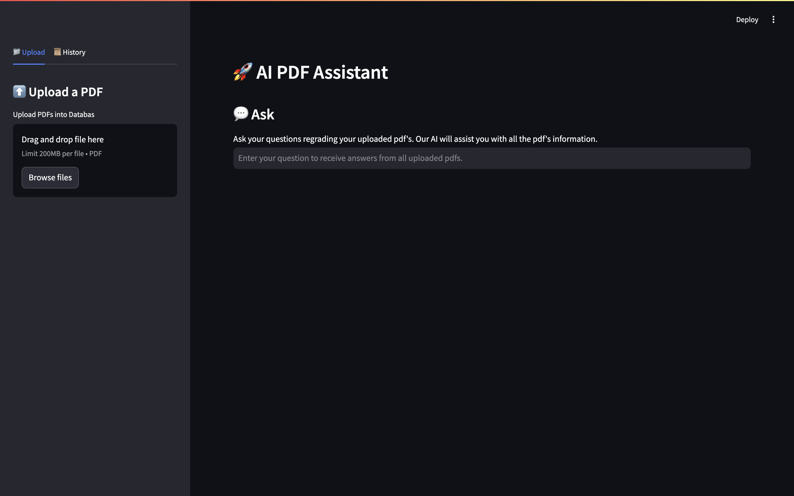
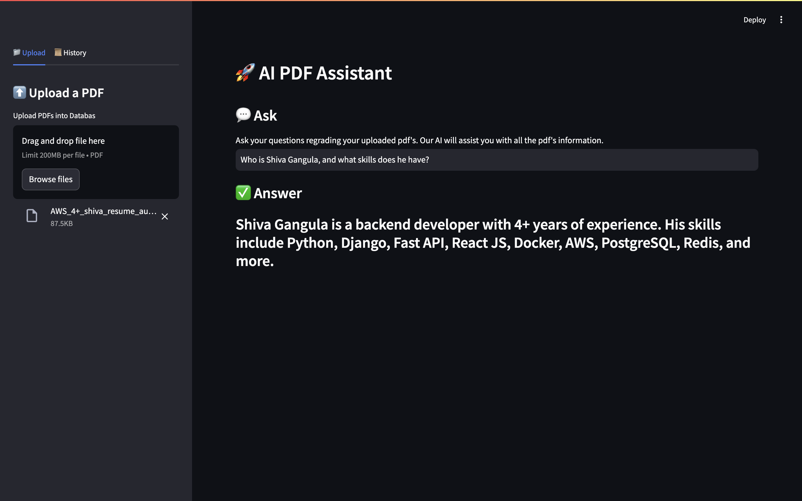

# 🚀 AI PDF Assistant

AI PDF Assistant reads all uploaded PDF files and generates questions and answers from them, built using LangChain, Streamlit, and OpenAI.


## Setup Instructions

### 1. Clone the Repository
```bash
git clone <repository_name>
```

### 2. Create a Python Virtual Environment
```bash
python -m venv env
```

### 3. Activate the Virtual Environment

- **For Windows:**
  ```bash
  .\env\Scripts\activate
  ```
- **For macOS/Linux:**
  ```bash
  source env/bin/activate
  ```

### 4. Navigate to the Project Directory
```bash
cd <repository_name>
```

### 5. Create a `.env` File
Create a `.env` file in the root directory of the project and add your OpenAI key:

```
OPEN_AI_KEY=your_open_ai_key_here
```

### 6. Install the Required Packages
```bash
pip install -r requirements.txt
```

### 7. Run the Application
```bash
streamlit run app.py
```

## How to Use
1. **Run the Application:**
   After starting the application, open your web browser. http://localhost:8501/

2. **Upload PDFs:**
   - Keep the left-side menu open and click on 'Upload'. 
   - You can upload any number of PDFs one after one. 

   

3. **Interact with the Assistant:**
   - For example, i am upload my resume, you can then ask questions about it.
   - Once the PDF is uploaded, ask questions related to the content of the PDF.
   - The assistant will provide answers based on the uploaded document.

   